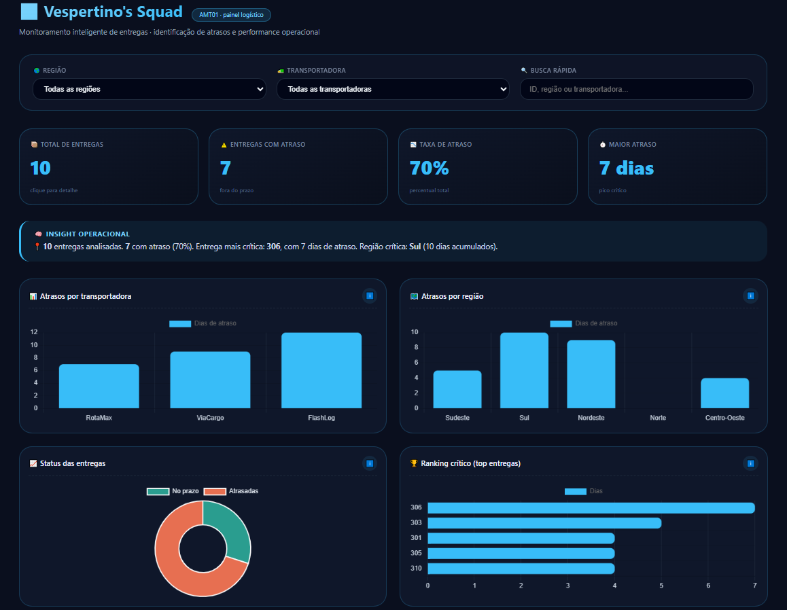

# Vespertino's - Dashboard Inteligente de Monitoramento Logístico

## 📌 Sobre o Projeto

Este projeto foi desenvolvido pelo Vespertino's Squad, para atender ao desafio de criação de um dashboard inteligente para monitoramento logístico. O objetivo é permitir que gestores acompanhem atrasos em entregas, identifiquem gargalos operacionais e apoiem a tomada de decisão por meio de visualizações interativas e indicadores estratégicos.

A experiência nos permitiu aplicar, na prática, conceitos de análise de dados, visualização de informações e resolução de problemas de negócio, aproximando ainda mais nosso squad das atividades desempenhadas por profissionais da área.

🚀 Uma solução desenvolvida para transformar dados em decisões.

---

## 👥 Integrantes do Squad

* Ana Laura
* João Bazan
* Kauhan
* Emilly Rafaela

## 📸 Preview do Dashboard


## 🎯 Objetivos da Solução

O dashboard foi projetado para:

* Identificar rapidamente entregas atrasadas;
* Comparar o desempenho entre transportadoras;
* Localizar regiões com maior concentração de atrasos;
* Priorizar ocorrências críticas;
* Disponibilizar indicadores visuais para apoio à tomada de decisão;
* Permitir filtragem e exploração dos dados.

---

## 🛠️ Tecnologias Utilizadas

### Front-end

* HTML5
* CSS3
* JavaScript (Vanilla JS)

### Visualização de Dados

* Chart.js

### Hospedagem

* GitHub Pages

---

## 📊 Metodologia de Análise

### Identificação de Atrasos

Cada entrega possui:

* Prazo previsto (`prazo`)
* Tempo real de execução (`diasReais`)

O atraso é calculado pela fórmula:

```javascript
Math.max(0, diasReais - prazo)
```

Quando o valor resultante é maior que zero, a entrega é considerada atrasada.

---

### Classificação de Criticidade

As entregas foram categorizadas em três níveis:

| Status   | Critério                  |
| -------- | ------------------------- |
| No prazo | 0 dias de atraso          |
| Atenção  | 1 a 2 dias de atraso      |
| Crítico  | Acima de 2 dias de atraso |

Essa classificação é utilizada para gerar alertas visuais e facilitar a identificação dos problemas mais relevantes.

---

## 📈 Indicadores Implementados

O dashboard apresenta os seguintes KPIs:

### Total de Entregas

Quantidade de entregas considerando os filtros aplicados.

### Entregas Atrasadas

Número total de entregas com atraso.

### Taxa de Atraso

```text
(Entregas Atrasadas ÷ Total de Entregas) × 100
```

Representa o percentual de entregas fora do prazo.

### Maior Atraso

Maior quantidade de dias de atraso encontrada entre as entregas filtradas.

---

## 📊 Visualizações Desenvolvidas

### Atrasos por Transportadora

Gráfico de barras que consolida os dias de atraso acumulados por transportadora.

Objetivo:

* Comparar desempenho operacional;
* Identificar parceiros com maior índice de atraso.

---

### Atrasos por Região

Gráfico de barras que exibe o total de dias de atraso por região.

Objetivo:

* Localizar regiões críticas;
* Apoiar decisões logísticas e redistribuição de recursos.

---

### Status das Entregas

Gráfico de rosca com a proporção entre:

* Entregas no prazo;
* Entregas atrasadas.

Objetivo:

* Fornecer visão executiva rápida da operação.

---

### Ranking de Entregas Críticas

Ranking com as 5 entregas de maior atraso.

Objetivo:

* Priorizar ações corretivas;
* Direcionar atenção aos casos mais urgentes.

---

## 🔎 Recursos de Interatividade

### Filtros

O dashboard permite filtrar os dados por:

* Região
* Transportadora

### Busca Inteligente

Campo de pesquisa para localizar entregas por:

* ID da entrega
* Região
* Transportadora

### Modais Informativos

Ao clicar em gráficos, indicadores ou linhas da tabela, o usuário recebe informações detalhadas sobre o item selecionado.

### Insights Automáticos

O sistema gera automaticamente análises resumidas contendo:

* Quantidade de entregas analisadas;
* Taxa de atraso;
* Entrega mais crítica;
* Região mais problemática.

---

## 🏆 Estratégia de Priorização

Para apoiar a tomada de decisão, os dados são organizados por nível de criticidade.

A priorização segue os seguintes critérios:

1. Maior número de dias em atraso;
2. Acúmulo de atrasos por região;
3. Acúmulo de atrasos por transportadora;
4. Destaque visual para entregas classificadas como críticas.

Dessa forma, os gestores conseguem identificar rapidamente os principais gargalos operacionais.

---

## 📂 Estrutura do Projeto

```text
/
├── index.html
├── imagem/dashboard-preview.png
├── css/style.css
├── js/script.js
└── README.md
```

---

## 🌐 Acesso ao Dashboard

O dashboard está disponível online através do GitHub Pages:

🔗 **Dashboard:** [Acessar Projeto](https://SEU-USUARIO.github.io/NOME-DO-REPOSITORIO)

> Recomenda-se testar o acesso em uma janela anônima para garantir que não haja restrições de visualização.

---

## 📸 Preview do Dashboard

<p align="center">
  
</p>

---

## 🔗 Repositório do Projeto

Código-fonte disponível em:

[https://vespertinostech.github.io/dashboard]


## 📌 Conclusão

A solução atende aos requisitos do desafio ao fornecer um dashboard funcional, interativo e orientado à tomada de decisão. A combinação de indicadores, filtros, rankings e visualizações gráficas permite identificar rapidamente atrasos, regiões críticas e transportadoras com baixo desempenho, transformando dados operacionais em informações estratégicas.
